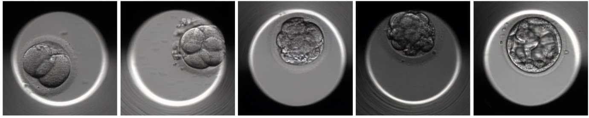

# Embryo Image Generation and Classification

## [Paper](TBD) | [GitHub](https://github.com/orianapresacan/Embryo)

 

## Overview

This repository contains code for training two generative models—a diffusion model and a generative adversarial network (GAN)—to produce synthetic images of embryos at various developmental stages. It also includes scripts for three classification models—ResNet, VGG, and Vision Transformer—used to classify these embryos.

## Repository Structure

This repository contains the code and data used in the study and is organized into three main folders:

### Latent Diffusion Model

The code is sourced from its original repository, which can be accessed [here](https://github.com/CompVis/latent-diffusion).

### StyleGAN

The code is based on the repository available [here]().

### Classification

## License
[MIT](https://choosealicense.com/licenses/mit/)

## For more details:
Please contact: orianapresacan@gmail.com
